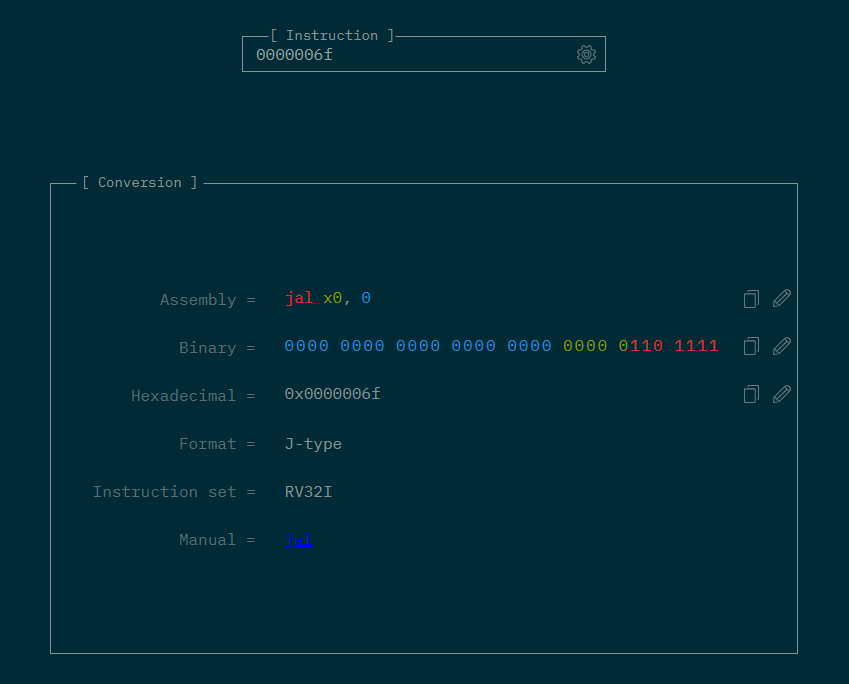

# Demo: How Assembly Language Works

## Introduction

In this tutorial, we will use the **Quick Emulator (QEMU)** to emulate a hardware (CPU) architecture, allowing us to stick to a specific **Instruction Set Architecture (ISA)**.

### ISA Used

The ISA used in this tutorial is **RISC-V**, specifically `rv32i`, meaning we are emulating a 32-bit RISC-V CPU with integer-only instructions.

---

## Toolchain Setup

Install the required toolchain, QEMU, and GDB using the following commands:

```bash
sudo apt update -y
sudo apt install -y gcc-riscv64-unknown-elf qemu-system-misc gdb-multiarch
```

> 💡 **Note:** Even though the toolchain is named `riscv64-unknown-elf-gcc`, it can compile for 32-bit targets like `rv32i` when passed the appropriate `-march` and `-mabi` flags.

---

## RISC-V Reference Material

- 📄 **RISC-V 32i Instruction Encoding**: [Download PDF](https://github.com/jameslzhu/riscv-card/releases/download/latest/riscv-card.pdf)

---

## Useful Tools

1. 🔧 [RISC-V Instruction Decoder](https://luplab.gitlab.io/rvcodecjs/)
2. 🧩 [GDB Dashboard](https://github.com/cyrus-and/gdb-dashboard)
3. 📘 Assembler Documentation:
    - [GNU Assembler Manual](https://ftp.gnu.org/old-gnu/Manuals/gas/html_chapter/as_7.html)
    - [RISC-V Specific Directives](https://sourceware.org/binutils/docs-2.31/as/RISC_002dV_002dDirectives.html)

---

## Compiling RISC-V Assembly

Use the following command to compile your RISC-V assembly file:

```bash
riscv64-unknown-elf-gcc -O0 -ggdb -nostdlib -march=rv32i -mabi=ilp32 -Wl,-Tm.ld m.s -o main.elf
```

### Breakdown

- `riscv64-unknown-elf-gcc`: RISC-V GCC compiler.
- `-nostdlib`: Do not include the standard library.
- `-march=rv32i`: Target the RV32I (32-bit integer) architecture.
- `-mabi=ilp32`: Use 32-bit integer, long, and pointer types.
- `-Wl,-Tm.ld`: Link with custom linker script `m.ld`.

This will generate `main.elf` as the output.

---

## Running the ELF on QEMU (riscv32)

```bash
qemu-system-riscv32 -S -M virt -nographic -bios none -kernel main.elf -gdb tcp::1234
```

### Explanation

- `-S`: Halt CPU at the first instruction (`j _start`).
- `-M virt`: Emulate a virtual RISC-V machine.
- `-nographic`: Disable graphics output.
- `-bios none`: Don't load any BIOS.
- `-kernel main.elf`: Load the ELF as the kernel image.
- `-gdb tcp::1234`: Enable GDB remote debugging on port 1234.

> ⚠️ Ensure your linker script (`m.ld`) places `_start` at `0x80000000`, as that is where the virtual machine's RAM typically begins when using `-M virt`.

---

## Debugging with GDB

Open another terminal and run:

```bash
gdb-multiarch main.elf -ex "target remote localhost:1234" -ex "break _start" -ex "continue" -q
```

### Explanation

- `gdb-multiarch main.elf`: Start debugging session for `main.elf`.
- `-ex "target remote localhost:1234"`: Connect GDB to QEMU.
- `-ex "break _start"`: Set breakpoint at `_start`.
- `-ex "continue"`: Start/resume execution.
- `-q`: Suppress startup messages.

### Sample Output

```bash
Reading symbols from main.elf...
Remote debugging using localhost:1234
0x00001000 in ?? ()
Breakpoint 1 at 0x80000000: file m.s, line 2.
Continuing.

Breakpoint 1, _start () at m.s:2
2           j _start
```

### Explanation of Output

- Breakpoint hit at `0x80000000`, the start of `.text` (RAM).
- Instruction at line 2 (`j _start`) is about to be executed.

---

## Viewing Register Values

In GDB, run:

```bash
info reg
```

### Example Output

```bash
ra             0x0      0x0
sp             0x0      0x0
gp             0x0      0x0
tp             0x0      0x0
t0             0x80000000       -2147483648
t1             0x0      0
t2             0x0      0
fp             0x0      0x0
s1             0x0      0
a0             0x0      0
a1             0x87e00000       -2015363072
a2             0x1028   4136
...
pc             0x80000000       0x80000000 <_start>
```

- `pc` shows the address of the next instruction: `_start`.

> 📝 These values are for demonstration and will vary based on the instruction flow and initial setup.

---

## Exiting

- **GDB**: Type `q`.
- **QEMU**: Press `Ctrl + A`, release, then press `x`.

---

## ELF and Binary Inspection

ELF files contain metadata used for debugging. To see the raw binary code:

```bash
riscv64-unknown-elf-objcopy -O binary main.elf main.bin
```

- `objcopy`: Converts ELF to raw binary (`main.bin`).

### Pretty Print the Binary

```bash
xxd -e -c 4 -g 4 main.bin
```

#### Sample Output

```bash
00000000: 0000006f   o...
```

### What is `0x0000006f`?

This is the machine code for:

```asm
_start:
    j _start
```

- `j _start` is a **pseudo-instruction**, translated to:
  
```asm
jal x0, 0
```

- It causes a jump to the current address, effectively creating an infinite loop.

> 🔍 You can confirm this using the [RISC-V Instruction Decoder](https://luplab.gitlab.io/rvcodecjs/) or refer to the official ISA manual.



Additionally, in the ISA spec:

> `j 0x0` is defined as a **pseudo-instruction** that maps to `jal x0, 0`, which does not link and jumps with a zero offset.


