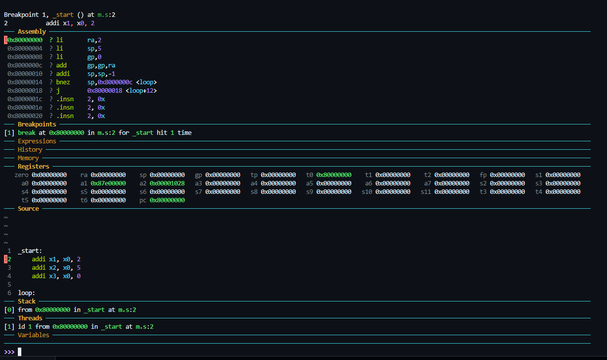
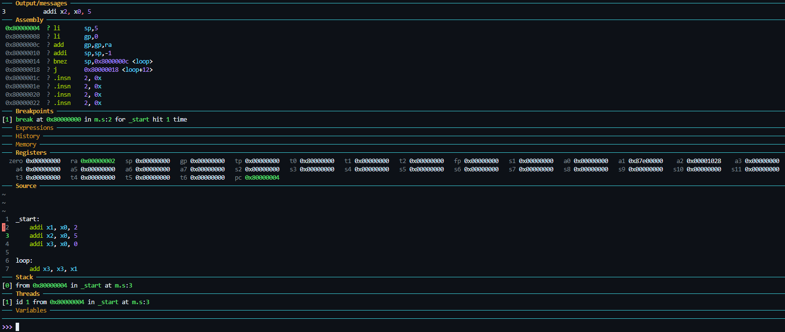
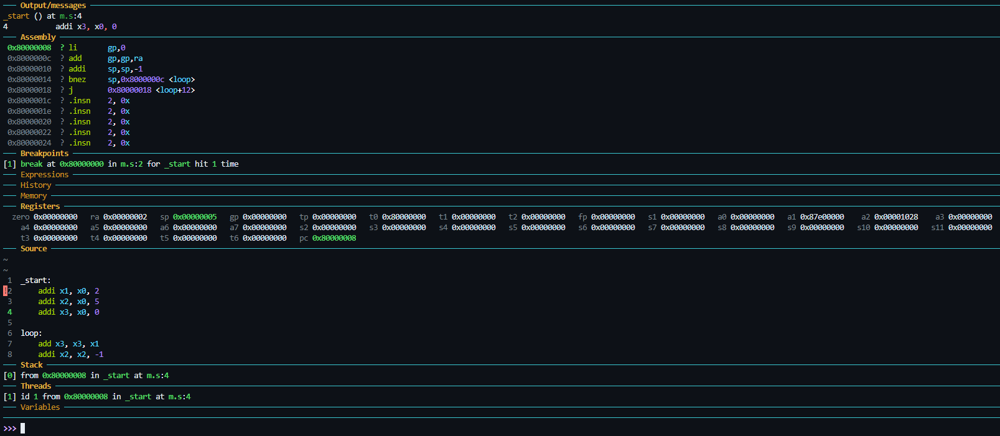
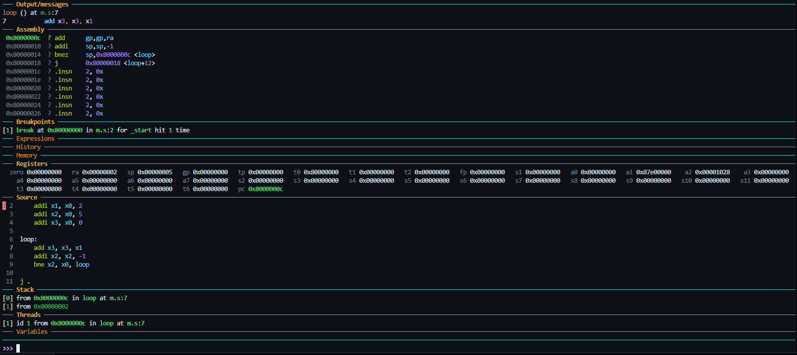
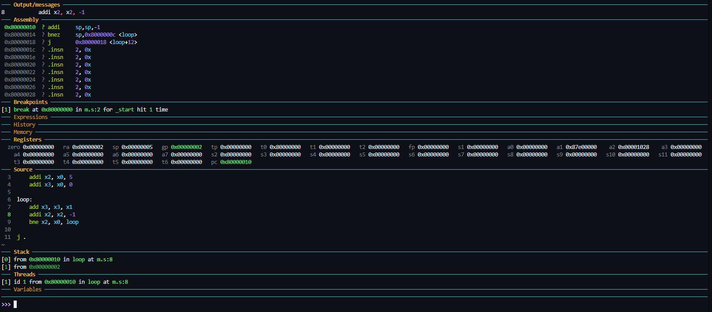
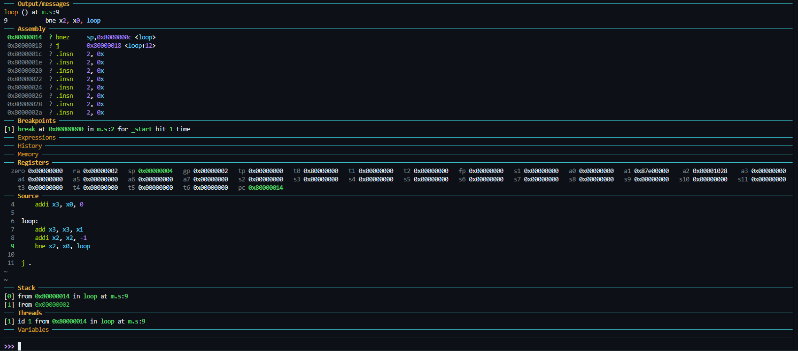
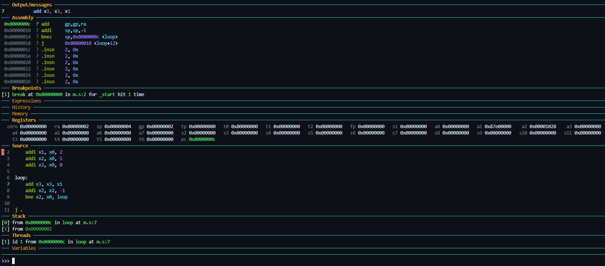

### Using `as` – GNU Assembler

- 📘 Refer to: [Assembler Directives](https://ftp.gnu.org/old-gnu/Manuals/gas-2.9.1/html_chapter/as_7.html)

---

### Let's Understand with an Example

Suppose we want to add the value of `x1` to `x3`, `x2` number of times.  
This is the equivalent high-level C-style expression:

```c
for (x2 = 5; x2 > 0; x2--) {
    x3 = x3 + x1;
}
```

---

### Assembly Version

```asm
_start:
    addi x1, x0, 2      # x1 = 2
    addi x2, x0, 5      # x2 = 5 (loop count)
    addi x3, x0, 0      # x3 = 0 (result accumulator)

loop: 
    add x3, x3, x1      # x3 = x3 + x1
    addi x2, x2, -1     # x2--
    bne x2, x0, loop    # if x2 != 0, go back to 'loop'

    j .                # infinite jump (halt substitute)
```

---

### Explanation

#### 🔹 Loading Immediate Values

> 💡 Since the values are not being copied from other registers and are directly user-fed constants, we use **immediate-type instructions** (`addi`).

- `addi x1, x0, 2` &nbsp;&nbsp;&nbsp;&nbsp;→ Load `2` into `x1`
- `addi x2, x0, 5` &nbsp;&nbsp;&nbsp;&nbsp;→ Load `5` into `x2`
- `addi x3, x0, 0` &nbsp;&nbsp;&nbsp;&nbsp;→ Initialize `x3` to `0`

> ℹ️ `x0` is the zero register and always holds the value `0`.

#### 🔹 Performing Addition

Once the values are loaded into registers, we can implement the expression `x3 = x3 + x1`:

- `add x3, x3, x1` → Uses the **R-type instruction** format since all operands are registers.

#### 🔹 Loop Control and Termination

To repeat the operation and eventually exit:

- `addi x2, x2, -1` → Decrement the loop counter `x2` by 1.
- `bne x2, x0, loop` → If `x2 ≠ 0`, branch back to the `loop` label.

---

### GDB Execution Walkthrough

When you run the program and connect GDB to QEMU, execution halts at the first instruction.

#### 🟡 Initial State
- 
  - **PC at 0x80000000**, waiting to execute `_start`.

---

#### Step 1: `ni` (next instruction)

- 
  - Executed: `addi x1, x0, 2`
  - ✅ `x1` now holds `2`
  - 🧠 `pc` incremented to `0x80000004`

---

#### Step 2: `ni`

- 
  - Executed: `addi x2, x0, 5`
  - ✅ `x2` now holds `5`
  - 🧠 `pc` incremented to `0x80000008`

---

#### Step 3: `ni`

- 
  - Executed: `addi x3, x0, 0`
  - ✅ `x3` now holds `0`
  - 🧠 `pc` incremented to `0x8000000C`

---

#### Step 4: `ni`

- 
  - Executed: `add x3, x3, x1`
  - ✅ `x3` updated to `2` (`0 + 2`)
  - 🧠 `pc` incremented to `0x80000010`

---

#### Step 5: `ni`

- 
  - Executed: `addi x2, x2, -1`
  - ✅ `x2` decremented to `4`
  - 🧠 `pc` incremented to `0x80000014`

---

#### Step 6: `ni`

- 
  - Executed: `bne x2, x0, loop`
  - ✅ Since `x2 ≠ 0`, it **jumps to the label** `loop` (at `0x8000000C`)
  - 🧠 `pc` updated to `0x8000000C`

##### This cycle (step 4-6) continues till `x2` becomes `0`

> 💡 Labels like `loop:` are just symbolic names; they hold the address of the instruction that immediately follows.

---

### Summary

This example demonstrates:

- ✅ How to use **`addi`** to load constants into registers.
- ✅ How to use **`add`** for register-based arithmetic.
- ✅ How to structure and control loops using **branch instructions** (`bne`) and **labels**.
- ✅ How GDB helps visualize step-by-step instruction execution and how `pc` (Program Counter) advances.

