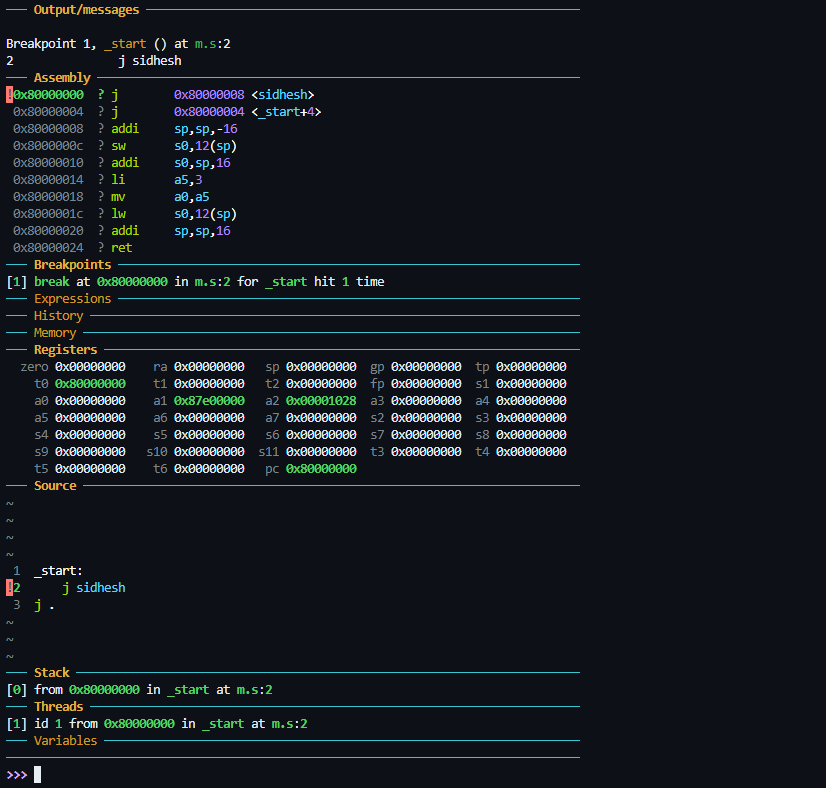
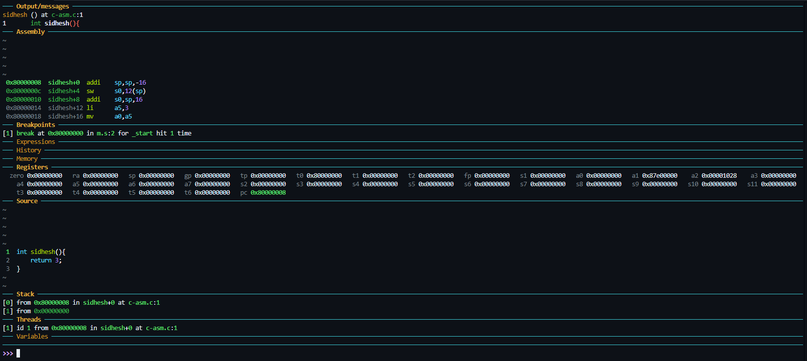
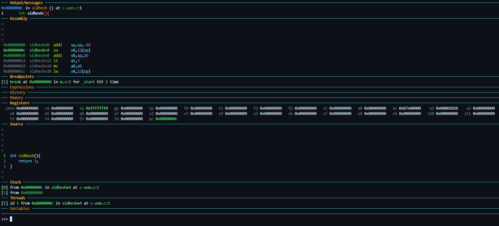

# Decomposing C to Assembly — Understanding the Relationship

Let’s explore how a simple C function is translated into RISC-V assembly, understand how it interacts with the stack, and learn how to run it properly on bare metal using a custom entry point.

---

## Step 1: Writing a Simple C Function

Create a file named `c-asm.c`:

```c
int sidhesh() {
    return 3;
}
```

This function simply returns the integer value `3`.

---

## Step 2: Compiling C to Assembly

To generate the corresponding assembly file from the `.c` source, run:

```bash
riscv64-unknown-elf-gcc -O0 -nostdlib -march=rv32i -mabi=ilp32 -Wl,-Tm.ld c-asm.c -S -o c-asm.s
```

### Compiler Flags

- `-S` : Generates assembly output only.
- `-O0` : Disables optimizations for clarity.
- `-nostdlib` : Excludes linking standard libraries.
- `-march=rv32i` : Targets the RV32I RISC-V ISA.
- `-mabi=ilp32` : Uses the ILP32 ABI (32-bit int/long/pointer).
- `-Wl,-Tm.ld` : Uses the custom linker script `m.ld`.

This produces `c-asm.s`.

---

## Step 3: Output — `c-asm.s`

```asm
.file   "c-asm.c"
.option nopic
.attribute arch, "rv32i2p1"
.attribute unaligned_access, 0
.attribute stack_align, 16
.text
.align  2
.globl  sidhesh
.type   sidhesh, @function
sidhesh:
    addi    sp, sp, -16
    sw      s0, 12(sp)
    addi    s0, sp, 16
    li      a5, 3
    mv      a0, a5
    lw      s0, 12(sp)
    addi    sp, sp, 16
    jr      ra
.size   sidhesh, .-sidhesh
.ident  "GCC: (13.2.0-11ubuntu1+12) 13.2.0"
```

---

## Step 4: Understanding the Assembly

- `addi sp, sp, -16` → Allocates 16 bytes on the stack.
- `sw s0, 12(sp)` → Saves frame pointer `s0`.
- `addi s0, sp, 16` → Sets up new frame pointer.
- `li a5, 3` → Loads 3 into register `a5`.
- `mv a0, a5` → Moves the return value to `a0`.
- `lw s0, 12(sp)` → Restores frame pointer.
- `addi sp, sp, 16` → Deallocates the stack.
- `jr ra` → Returns to the caller.

---

### 🔎 Key Concepts

> **🔁 `ra` (Return Address Register)**: Automatically holds the return address when a function is called via `jal`. Used by `jr ra` to return control.

> **📦 `sp` (Stack Pointer)**: Points to the top of the stack, where temporary data like return addresses or frame pointers are saved.

---

## Step 5: Adding an Entry Point

Since `c-asm.c` has no `main()`, we define our own entry point in a new assembly file: `m.s`.

```asm
_start:
    j sidhesh      # Jump directly to sidhesh (unsafe)
    j .            # Infinite loop (halt)
```

Then compile both files together into an ELF binary:

```bash
riscv64-unknown-elf-gcc -O0 -ggdb -nostdlib -march=rv32i -mabi=ilp32 -Wl,-Tm.ld m.s c-asm.c -o main.elf
riscv64-unknown-elf-objcopy -O binary main.elf main.bin
```

---

## Step 6: Debugging the Crash in GDB

When you run this binary and use GDB to step through (`ni`), you'll observe a crash at the beginning of `sidhesh()`:

```asm
addi sp, sp, -16
sw   s0, 12(sp)
```

### 🔥 Why It Crashes

At this point, the `sp` (stack pointer) was **never initialized**, so it holds garbage — e.g., `0x00000000` or `0xfffffff0`. Writing to this invalid address causes a fault.

#### Visual Trace:
- Execution halts at `_start`
  - 
- After one `ni`, control jumps to `sidhesh`
  - 
- On `addi sp, sp, -16`, `sp` becomes invalid (`0xfffffff0`)
  - 

---

## Step 7: Fixing the Stack

Initialize the stack pointer in `_start` before calling the function:

```asm
_start:
    li sp, 0x80002000     # Allocate a valid stack in RAM
    j sidhesh
    j .
```

But now there's another issue...

---

## Step 8: Fixing Return Behavior

`sidhesh()` ends with `jr ra`, which means it expects the return address to be in `ra`. But in our current code:

```asm
j sidhesh
```

...we **jump**, but don't link — so `ra` is never set. When `jr ra` executes, it jumps to an undefined address.

### ✅ Correct Way — Use `jal` (Jump and Link)

To store the return address, use `jal`:

```asm
_start:
    li sp, 0x80002000
    jal sidhesh           # Jump to sidhesh and store return address in ra
    j .                   # Halt after return
```

---

## ✅ Summary

- We compiled a C function into assembly using `-S`.
- Learned how GCC sets up the stack and returns values in RISC-V.
- Discovered that running C functions on bare metal requires:
  - Manual setup of the stack (`sp`).
  - Proper use of `jal` to store return addresses (`ra`).
- Observed that omitting these can lead to memory faults or undefined behavior.

> 🧠 Always set `sp` and use `jal` when calling functions in bare-metal setups!
